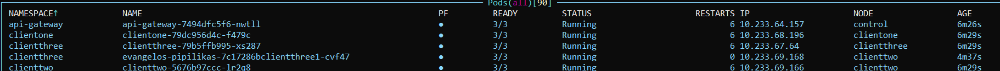

## Install the Control Plane
```
PS C:\Users\apipi> linkerd check

kubernetes-api

--------------

√ can initialize the client

√ can query the Kubernetes API


kubernetes-version

------------------

√ is running the minimum Kubernetes API version


linkerd-existence

-----------------

× 'linkerd-config' config map exists

    configmaps "linkerd-config" not found

    see https://linkerd.io/2/checks/#l5d-existence-linkerd-config for hints


Status check results are ×
```

```
linkerd install --crds > crds.yaml
kubectl apply -f crds.yaml

linkerd install > linkerd.yaml
kubectl apply -f linkerd.yaml

linkerd check

```

# Prometheus

## Error while initializing prometheus
```
M1    node-exporter  ●  quay.io/prometheus/node-exporter:v1.11.0  false  CrashLoopBackOff        77

to try resolving symlinks in path "/var/log/pods/default_prometheus-prometheus-node-exporter-lc9jf_d ││ 82ddaae-cf2b-491d-a602-e45553a8a52e/node-exporter/77.log": lstat /var/log/pods/default_prometheus-pr ││ ometheus-node-exporter-lc9jf_d82ddaae-cf2b-491d-a602-e45553a8a52e/node-exporter/77.log: no such file ││  or directorystream closed: EOF for default/prometheus-prometheus-node-exporter-lc9jf (node-exporter ││ )

kubectl logs -l app.kubernetes.io/name=prometheus-node-exporter -n default --previous | tail -n 15

failed to try resolving symlinks in path "/var/log/pods/default_prometheus-prometheus-node-exporter-lc9jf_d82ddaae-cf2b-491d-a602-e45553a8a52e/node-exporter/77.log": lstat /var/log/pods/default_prometheus-prometheus-node-exporter-lc9jf_d82ddaae-cf2b-491d-a602-e45553a8a52e/node-exporter/77.log: no such file or directorya
```

I had to add the following in charts/monitoring/prometheus-values.yaml:
```yaml
prometheus-node-exporter:
  hostRootFsMount:
    enabled: false
``` 

# Grafana
## Deployment issue
First of all, we provided the following helm chart installation:
```
helm repo add grafana-community https://grafana-community.github.io/helm-charts
helm repo update
helm upgrade -i -f "${monitoring_chart}/grafana-values.yaml" grafana  grafana-community/grafana
```

When we deployed it, we got the following error:
```
404 Not Found

nginx/1.25.1
```

To fix this, we had to either port-forwarding or setting up the NGINX Front Gate. For the latter option, we had to configure the grafana helm charts as:
```yaml
apiVersion: networking.k8s.io/v1
kind: Ingress
metadata:
  name: grafana-manual-ingress
  namespace: default
  annotations:
    nginx.ingress.kubernetes.io/service-upstream: "true"
spec:
  ingressClassName: nginx
  rules:
  - host: grafana.local
    http:
      paths:
      - pathType: Prefix
        path: "/"
        backend:
          service:
            name: grafana
            port:
              number: 80
```
Add the following to C:\Windows\System32\drivers\etc\hosts:
```
127.0.0.1 grafana.local
```

## Dashboards displayed: No data
There was a disconnect in the pipeline with Prometheus. The fix was to add the following in grafana-values.yaml:
```yaml
datasources:
  datasources.yaml:
    apiVersion: 1
    datasources:
    - name: prometheus
      type: prometheus
      access: proxy
      orgId: 1
      url: http://prometheus-server.default.svc.cluster.local:80
      isDefault: true
      jsonData:
        timeInterval: "5s"
      editable: true
```
## f
```
502 Bad Gateway
nginx/1.25.1
```


# Kepler
## Installation failed
```
 time=2026-04-09T15:26:41.815Z level=ERROR source=cmd/kepler/main.go:58 msg="failed to initialize ser ││ vices" error="failed to initialize service rapl: failed to read rapl zones: unable to read class/pow ││ ercap: open /host/sys/class/powercap: no such file or directory" 
```
```
time=2026-04-13T13:35:49.112Z level=DEBUG source=cmd/kepler/main.go:129 msg="Creating all services"     time=2026-04-13T13:35:49.113Z level=INFO source=cmd/kepler/main.go:356 msg="GPU feature disabled"       time=2026-04-13T13:35:49.113Z level=INFO source=cmd/kepler/main.go:248 msg="using kubelet pod informer" pollInterval=15s                                                                                        time=2026-04-13T13:35:49.113Z level=DEBUG source=cmd/kepler/main.go:267 msg="Creating Prometheus exporter"                                                                                                      time=2026-04-13T13:35:49.113Z level=INFO source=internal/service/initializer.go:31 msg="Initializing service" service=kubeletPodInformer                                                                        W0413 13:35:49.113851    3474 client_config.go:659] Neither --kubeconfig nor --master was specified.  Using the inClusterConfig.  This might not work.                                                          time=2026-04-13T13:35:49.124Z level=DEBUG source=k8s/pod/kubelet.go:160 msg="discovered kubelet endpoint" service=kubeletPodInformer host=192.168.65.3 port=10250                                               time=2026-04-13T13:35:49.149Z level=DEBUG source=k8s/pod/kubelet.go:245 msg="refreshed pod cache from kubelet" service=kubeletPodInformer podCount=16 containerCount=30                                         time=2026-04-13T13:35:49.149Z level=INFO source=k8s/pod/kubelet.go:113 msg="kubelet pod informer initialized" service=kubeletPodInformer nodeName=docker-desktop kubeletHost=192.168.65.3 kubeletPort=10250 pollInterval=15s                                                                                            time=2026-04-13T13:35:49.149Z level=INFO source=internal/service/initializer.go:31 msg="Initializing service" service=resource-informer                                                                         time=2026-04-13T13:35:49.150Z level=INFO source=internal/resource/informer.go:162 msg="Resource informer initialized successfully" service=resource-informer                                                    time=2026-04-13T13:35:49.150Z level=INFO source=internal/service/initializer.go:31 msg="Initializing service" service=rapl                                                                                      time=2026-04-13T13:35:49.150Z level=INFO source=internal/service/initializer.go:43 msg="Shutting down initialized services"                                                                                     time=2026-04-13T13:35:49.150Z level=DEBUG source=internal/service/initializer.go:47 msg="skipping service shutdown" service=kubeletPodInformer reason="service does not implement Shutdowner"                   time=2026-04-13T13:35:49.150Z level=DEBUG source=internal/service/initializer.go:47 msg="skipping service shutdown" service=resource-informer reason="service does not implement Shutdowner"                    time=2026-04-13T13:35:49.150Z level=ERROR source=cmd/kepler/main.go:58 msg="failed to initialize services" error="failed to initialize service rapl: failed to read rapl zones: unable to read class/powercap: open /host/sys/class/powercap: no such file or directory"
```

powercap (Intel RAPL) for managing CPU power limits is generally not supported in WSL because the required /sys/class/powercap or /sys/devices/virtual/powercap directories are not exposed by the WSL kernel. Consequently, tools relying on these files (e.g., powercap-set, PowerJoular) fail to access RAPL energy data.

https://github.com/sustainable-computing-io/kepler/issues/2262

# General
## Installing 'sfr-pyrca' from requirements.txt

```
Building wheels for collected packages: javabridge
  Building wheel for javabridge (setup.py) ... error
  ERROR: Command errored out with exit status 1:
   command: 'C:\Users\apipi\AppData\Local\Programs\Python\Python310\python.exe' -u -c 'import io, os, sys, setuptools, tokenize; sys.argv[0] = '"'"'C:\\Users\\apipi\\AppData\\Local\\Temp\\pip-install-9x7dvw38\\javabridge_68fd772e133e4bce9d0bcf3dea36280a\\setup.py'"'"'; __file__='"'"'C:\\Users\\apipi\\AppData\\Local\\Temp\\pip-install-9x7dvw38\\javabridge_68fd772e133e4bce9d0bcf3dea36280a\\setup.py'"'"';f = getattr(tokenize, '"'"'open'"'"', open)(__file__) if os.path.exists(__file__) else io.StringIO('"'"'from setuptools import setup; setup()'"'"');code = f.read().replace('"'"'\r\n'"'"', '"'"'\n'"'"');f.close();exec(compile(code, __file__, '"'"'exec'"'"'))' bdist_wheel -d 'C:\Users\apipi\AppData\Local\Temp\pip-wheel-l67i2m37'
       cwd: C:\Users\apipi\AppData\Local\Temp\pip-install-9x7dvw38\javabridge_68fd772e133e4bce9d0bcf3dea36280a\
  Complete output (70 lines):
  C:\Users\apipi\AppData\Local\Programs\Python\Python310\lib\site-packages\wheel\bdist_wheel.py:4: FutureWarning: The 'wheel' package is no longer the canonical location of the 'bdist_wheel' command, and will be removed in a future release. Please update to setuptools v70.1 or later which contains an integrated version of this command.
    warn(
  running bdist_wheel
  running build
  running build_py
  creating build
  creating build\lib.win-amd64-3.10
  creating build\lib.win-amd64-3.10\javabridge
  copying javabridge\jutil.py -> build\lib.win-amd64-3.10\javabridge
  copying javabridge\locate.py -> build\lib.win-amd64-3.10\javabridge
  copying javabridge\noseplugin.py -> build\lib.win-amd64-3.10\javabridge
  copying javabridge\wrappers.py -> build\lib.win-amd64-3.10\javabridge
  copying javabridge\_version.py -> build\lib.win-amd64-3.10\javabridge
  copying javabridge\__init__.py -> build\lib.win-amd64-3.10\javabridge
  creating build\lib.win-amd64-3.10\javabridge\tests
  copying javabridge\tests\test_cpython.py -> build\lib.win-amd64-3.10\javabridge\tests
  copying javabridge\tests\test_javabridge.py -> build\lib.win-amd64-3.10\javabridge\tests
  copying javabridge\tests\test_jutil.py -> build\lib.win-amd64-3.10\javabridge\tests
  copying javabridge\tests\test_wrappers.py -> build\lib.win-amd64-3.10\javabridge\tests
  copying javabridge\tests\__init__.py -> build\lib.win-amd64-3.10\javabridge\tests
  creating build\lib.win-amd64-3.10\javabridge\jars
  copying javabridge\jars\cpython.jar -> build\lib.win-amd64-3.10\javabridge\jars
  copying javabridge\jars\rhino-1.7R4.jar -> build\lib.win-amd64-3.10\javabridge\jars
  copying javabridge\jars\runnablequeue.jar -> build\lib.win-amd64-3.10\javabridge\jars
  copying javabridge\jars\test.jar -> build\lib.win-amd64-3.10\javabridge\jars
  running build_ext
  C:\Program Files\Java\jdk-25\bin\javac.exe C:\Users\apipi\AppData\Local\Temp\pip-install-9x7dvw38\javabridge_68fd772e133e4bce9d0bcf3dea36280a\java\org\cellprofiler\runnablequeue\RunnableQueue.java
  C:\Program Files\Java\jdk-25\bin\javac.exe C:\Users\apipi\AppData\Local\Temp\pip-install-9x7dvw38\javabridge_68fd772e133e4bce9d0bcf3dea36280a\java\org\cellprofiler\javabridge\test\RealRect.java
  C:\Program Files\Java\jdk-25\bin\javac.exe C:\Users\apipi\AppData\Local\Temp\pip-install-9x7dvw38\javabridge_68fd772e133e4bce9d0bcf3dea36280a\java\org\cellprofiler\javabridge\CPython.java C:\Users\apipi\AppData\Local\Temp\pip-install-9x7dvw38\javabridge_68fd772e133e4bce9d0bcf3dea36280a\java\org\cellprofiler\javabridge\CPythonInvocationHandler.java
  Note: C:\Users\apipi\AppData\Local\Temp\pip-install-9x7dvw38\javabridge_68fd772e133e4bce9d0bcf3dea36280a\java\org\cellprofiler\javabridge\CPythonInvocationHandler.java uses unchecked or unsafe operations.
  Note: Recompile with -Xlint:unchecked for details.
  building 'javabridge._javabridge' extension
  creating build\temp.win-amd64-3.10
  creating build\temp.win-amd64-3.10\Release
  C:\Program Files (x86)\Microsoft Visual Studio\2022\BuildTools\VC\Tools\MSVC\14.44.35207\bin\HostX86\x64\cl.exe /c /nologo /Ox /W3 /GL /DNDEBUG /MD -IC:\Program Files\Java\jdk-25\include -IC:\Program Files\Java\jdk-25\include\win32 -IC:\Users\apipi\AppData\Local\Programs\Python\Python310\lib\site-packages\numpy\core\include -IC:\Users\apipi\AppData\Local\Programs\Python\Python310\include -IC:\Users\apipi\AppData\Local\Programs\Python\Python310\Include -IC:\Program Files (x86)\Microsoft Visual Studio\2022\BuildTools\VC\Tools\MSVC\14.44.35207\include -IC:\Program Files (x86)\Microsoft Visual Studio\2022\BuildTools\VC\Auxiliary\VS\include -IC:\Program Files (x86)\Windows Kits\10\include\10.0.26100.0\ucrt -IC:\Program Files (x86)\Windows Kits\10\\include\10.0.26100.0\\um -IC:\Program Files (x86)\Windows Kits\10\\include\10.0.26100.0\\shared -IC:\Program Files (x86)\Windows Kits\10\\include\10.0.26100.0\\winrt -IC:\Program Files (x86)\Windows Kits\10\\include\10.0.26100.0\\cppwinrt /Tc_javabridge.c /Fobuild\temp.win-amd64-3.10\Release\_javabridge.obj
  _javabridge.c
  C:\Users\apipi\AppData\Local\Programs\Python\Python310\lib\site-packages\numpy\core\include\numpy\npy_1_7_deprecated_api.h(14) : Warning Msg: Using deprecated NumPy API, disable it with #define NPY_NO_DEPRECATED_API NPY_1_7_API_VERSION
  _javabridge.c(5159): warning C4311: 'type cast': pointer truncation from 'jobject' to 'int'
  _javabridge.c(5444): warning C4311: 'type cast': pointer truncation from 'jobject' to 'int'
  _javabridge.c(5668): warning C4311: 'type cast': pointer truncation from 'jclass' to 'int'
  _javabridge.c(6022): warning C4311: 'type cast': pointer truncation from 'jmethodID' to 'int'
  _javabridge.c(6301): warning C4311: 'type cast': pointer truncation from 'jfieldID' to 'int'
  _javabridge.c(6789): warning C4244: '=': conversion from 'long' to 'jchar', possible loss of data
  _javabridge.c(6978): warning C4244: '=': conversion from 'double' to 'jfloat', possible loss of data
  _javabridge.c(7883): warning C4244: '=': conversion from 'Py_ssize_t' to 'jint', possible loss of data
  _javabridge.c(8122): warning C4013: 'CreateJavaVM' undefined; assuming extern returning int
  _javabridge.c(8513): warning C4244: '=': conversion from 'Py_ssize_t' to 'jint', possible loss of data
  _javabridge.c(9199): warning C4013: 'StopVM' undefined; assuming extern returning int
  _javabridge.c(16069): warning C4244: '=': conversion from 'long' to 'jchar', possible loss of data
  _javabridge.c(16617): warning C4244: '=': conversion from 'double' to 'jfloat', possible loss of data
  _javabridge.c(18640): warning C4244: '=': conversion from 'long' to 'jchar', possible loss of data
  _javabridge.c(18916): warning C4244: '=': conversion from 'long' to 'jchar', possible loss of data
  _javabridge.c(19464): warning C4244: '=': conversion from 'double' to 'jfloat', possible loss of data
  _javabridge.c(20233): warning C4244: '=': conversion from 'Py_ssize_t' to 'jsize', possible loss of data
  _javabridge.c(20700): warning C4311: 'type cast': pointer truncation from 'jobject' to 'int'
  _javabridge.c(20828): warning C4311: 'type cast': pointer truncation from 'jobject' to 'int'
  _javabridge.c(22645): warning C4244: '=': conversion from 'npy_intp' to 'jsize', possible loss of data
  _javabridge.c(22911): warning C4244: '=': conversion from 'npy_intp' to 'jsize', possible loss of data
  _javabridge.c(23175): warning C4244: '=': conversion from 'npy_intp' to 'jsize', possible loss of data
  _javabridge.c(23439): warning C4244: '=': conversion from 'npy_intp' to 'jsize', possible loss of data
  _javabridge.c(23703): warning C4244: '=': conversion from 'npy_intp' to 'jsize', possible loss of data
  _javabridge.c(23967): warning C4244: '=': conversion from 'npy_intp' to 'jsize', possible loss of data
  _javabridge.c(24231): warning C4244: '=': conversion from 'npy_intp' to 'jsize', possible loss of data
  _javabridge.c(27720): error C2105: '++' needs l-value
  _javabridge.c(27722): error C2105: '--' needs l-value
  _javabridge.c(28308): error C2105: '++' needs l-value
  _javabridge.c(28310): error C2105: '--' needs l-value
  _javabridge.c(29747): warning C4047: 'return': 'int' differs in levels of indirection from 'void *'
  _javabridge.c(32461): warning C4996: 'PyUnicode_FromUnicode': deprecated in 3.3
  error: command 'C:\\Program Files (x86)\\Microsoft Visual Studio\\2022\\BuildTools\\VC\\Tools\\MSVC\\14.44.35207\\bin\\HostX86\\x64\\cl.exe' failed with exit code 2
  ----------------------------------------
  ERROR: Failed building wheel for javabridge
  Running setup.py clean for javabridge
Failed to build javabridge
Installing collected packages: javabridge, dill, sfr-pyrca
    Running setup.py install for javabridge ... error
    ERROR: Command errored out with exit status 1:
     command: 'C:\Users\apipi\AppData\Local\Programs\Python\Python310\python.exe' -u -c 'import io, os, sys, setuptools, tokenize; sys.argv[0] = '"'"'C:\\Users\\apipi\\AppData\\Local\\Temp\\pip-install-9x7dvw38\\javabridge_68fd772e133e4bce9d0bcf3dea36280a\\setup.py'"'"'; __file__='"'"'C:\\Users\\apipi\\AppData\\Local\\Temp\\pip-install-9x7dvw38\\javabridge_68fd772e133e4bce9d0bcf3dea36280a\\setup.py'"'"';f = getattr(tokenize, '"'"'open'"'"', open)(__file__) if os.path.exists(__file__) else io.StringIO('"'"'from setuptools import setup; setup()'"'"');code = f.read().replace('"'"'\r\n'"'"', '"'"'\n'"'"');f.close();exec(compile(code, __file__, '"'"'exec'"'"'))' install --record 'C:\Users\apipi\AppData\Local\Temp\pip-record-dukufnah\install-record.txt' --single-version-externally-managed --compile --install-headers 'C:\Users\apipi\AppData\Local\Programs\Python\Python310\Include\javabridge'
         cwd: C:\Users\apipi\AppData\Local\Temp\pip-install-9x7dvw38\javabridge_68fd772e133e4bce9d0bcf3dea36280a\
    Complete output (68 lines):
    running install
    running build
    running build_py
    creating build
    creating build\lib.win-amd64-3.10
    creating build\lib.win-amd64-3.10\javabridge
    copying javabridge\jutil.py -> build\lib.win-amd64-3.10\javabridge
    copying javabridge\locate.py -> build\lib.win-amd64-3.10\javabridge
    copying javabridge\noseplugin.py -> build\lib.win-amd64-3.10\javabridge
    copying javabridge\wrappers.py -> build\lib.win-amd64-3.10\javabridge
    copying javabridge\_version.py -> build\lib.win-amd64-3.10\javabridge
    copying javabridge\__init__.py -> build\lib.win-amd64-3.10\javabridge
    creating build\lib.win-amd64-3.10\javabridge\tests
    copying javabridge\tests\test_cpython.py -> build\lib.win-amd64-3.10\javabridge\tests
    copying javabridge\tests\test_javabridge.py -> build\lib.win-amd64-3.10\javabridge\tests
    copying javabridge\tests\test_jutil.py -> build\lib.win-amd64-3.10\javabridge\tests
    copying javabridge\tests\test_wrappers.py -> build\lib.win-amd64-3.10\javabridge\tests
    copying javabridge\tests\__init__.py -> build\lib.win-amd64-3.10\javabridge\tests
    creating build\lib.win-amd64-3.10\javabridge\jars
    copying javabridge\jars\cpython.jar -> build\lib.win-amd64-3.10\javabridge\jars
    copying javabridge\jars\rhino-1.7R4.jar -> build\lib.win-amd64-3.10\javabridge\jars
    copying javabridge\jars\runnablequeue.jar -> build\lib.win-amd64-3.10\javabridge\jars
    copying javabridge\jars\test.jar -> build\lib.win-amd64-3.10\javabridge\jars
    running build_ext
    C:\Program Files\Java\jdk-25\bin\javac.exe C:\Users\apipi\AppData\Local\Temp\pip-install-9x7dvw38\javabridge_68fd772e133e4bce9d0bcf3dea36280a\java\org\cellprofiler\runnablequeue\RunnableQueue.java
    C:\Program Files\Java\jdk-25\bin\javac.exe C:\Users\apipi\AppData\Local\Temp\pip-install-9x7dvw38\javabridge_68fd772e133e4bce9d0bcf3dea36280a\java\org\cellprofiler\javabridge\test\RealRect.java
    C:\Program Files\Java\jdk-25\bin\javac.exe C:\Users\apipi\AppData\Local\Temp\pip-install-9x7dvw38\javabridge_68fd772e133e4bce9d0bcf3dea36280a\java\org\cellprofiler\javabridge\CPython.java C:\Users\apipi\AppData\Local\Temp\pip-install-9x7dvw38\javabridge_68fd772e133e4bce9d0bcf3dea36280a\java\org\cellprofiler\javabridge\CPythonInvocationHandler.java
    Note: C:\Users\apipi\AppData\Local\Temp\pip-install-9x7dvw38\javabridge_68fd772e133e4bce9d0bcf3dea36280a\java\org\cellprofiler\javabridge\CPythonInvocationHandler.java uses unchecked or unsafe operations.
    Note: Recompile with -Xlint:unchecked for details.
    building 'javabridge._javabridge' extension
    creating build\temp.win-amd64-3.10
    creating build\temp.win-amd64-3.10\Release
    C:\Program Files (x86)\Microsoft Visual Studio\2022\BuildTools\VC\Tools\MSVC\14.44.35207\bin\HostX86\x64\cl.exe /c /nologo /Ox /W3 /GL /DNDEBUG /MD -IC:\Program Files\Java\jdk-25\include -IC:\Program Files\Java\jdk-25\include\win32 -IC:\Users\apipi\AppData\Local\Programs\Python\Python310\lib\site-packages\numpy\core\include -IC:\Users\apipi\AppData\Local\Programs\Python\Python310\include -IC:\Users\apipi\AppData\Local\Programs\Python\Python310\Include -IC:\Program Files (x86)\Microsoft Visual Studio\2022\BuildTools\VC\Tools\MSVC\14.44.35207\include -IC:\Program Files (x86)\Microsoft Visual Studio\2022\BuildTools\VC\Auxiliary\VS\include -IC:\Program Files (x86)\Windows Kits\10\include\10.0.26100.0\ucrt -IC:\Program Files (x86)\Windows Kits\10\\include\10.0.26100.0\\um -IC:\Program Files (x86)\Windows Kits\10\\include\10.0.26100.0\\shared -IC:\Program Files (x86)\Windows Kits\10\\include\10.0.26100.0\\winrt -IC:\Program Files (x86)\Windows Kits\10\\include\10.0.26100.0\\cppwinrt /Tc_javabridge.c /Fobuild\temp.win-amd64-3.10\Release\_javabridge.obj
    _javabridge.c
    C:\Users\apipi\AppData\Local\Programs\Python\Python310\lib\site-packages\numpy\core\include\numpy\npy_1_7_deprecated_api.h(14) : Warning Msg: Using deprecated NumPy API, disable it with #define NPY_NO_DEPRECATED_API NPY_1_7_API_VERSION
    _javabridge.c(5159): warning C4311: 'type cast': pointer truncation from 'jobject' to 'int'
    _javabridge.c(5444): warning C4311: 'type cast': pointer truncation from 'jobject' to 'int'
    _javabridge.c(5668): warning C4311: 'type cast': pointer truncation from 'jclass' to 'int'
    _javabridge.c(6022): warning C4311: 'type cast': pointer truncation from 'jmethodID' to 'int'
    _javabridge.c(6301): warning C4311: 'type cast': pointer truncation from 'jfieldID' to 'int'
    _javabridge.c(6789): warning C4244: '=': conversion from 'long' to 'jchar', possible loss of data
    _javabridge.c(6978): warning C4244: '=': conversion from 'double' to 'jfloat', possible loss of data
    _javabridge.c(7883): warning C4244: '=': conversion from 'Py_ssize_t' to 'jint', possible loss of data
    _javabridge.c(8122): warning C4013: 'CreateJavaVM' undefined; assuming extern returning int
    _javabridge.c(8513): warning C4244: '=': conversion from 'Py_ssize_t' to 'jint', possible loss of data
    _javabridge.c(9199): warning C4013: 'StopVM' undefined; assuming extern returning int
    _javabridge.c(16069): warning C4244: '=': conversion from 'long' to 'jchar', possible loss of data
    _javabridge.c(16617): warning C4244: '=': conversion from 'double' to 'jfloat', possible loss of data
    _javabridge.c(18640): warning C4244: '=': conversion from 'long' to 'jchar', possible loss of data
    _javabridge.c(18916): warning C4244: '=': conversion from 'long' to 'jchar', possible loss of data
    _javabridge.c(19464): warning C4244: '=': conversion from 'double' to 'jfloat', possible loss of data
    _javabridge.c(20233): warning C4244: '=': conversion from 'Py_ssize_t' to 'jsize', possible loss of data
    _javabridge.c(20700): warning C4311: 'type cast': pointer truncation from 'jobject' to 'int'
    _javabridge.c(20828): warning C4311: 'type cast': pointer truncation from 'jobject' to 'int'
    _javabridge.c(22645): warning C4244: '=': conversion from 'npy_intp' to 'jsize', possible loss of data
    _javabridge.c(22911): warning C4244: '=': conversion from 'npy_intp' to 'jsize', possible loss of data
    _javabridge.c(23175): warning C4244: '=': conversion from 'npy_intp' to 'jsize', possible loss of data
    _javabridge.c(23439): warning C4244: '=': conversion from 'npy_intp' to 'jsize', possible loss of data
    _javabridge.c(23703): warning C4244: '=': conversion from 'npy_intp' to 'jsize', possible loss of data
    _javabridge.c(23967): warning C4244: '=': conversion from 'npy_intp' to 'jsize', possible loss of data
    _javabridge.c(24231): warning C4244: '=': conversion from 'npy_intp' to 'jsize', possible loss of data
    _javabridge.c(27720): error C2105: '++' needs l-value
    _javabridge.c(27722): error C2105: '--' needs l-value
    _javabridge.c(28308): error C2105: '++' needs l-value
    _javabridge.c(28310): error C2105: '--' needs l-value
    _javabridge.c(29747): warning C4047: 'return': 'int' differs in levels of indirection from 'void *'
    _javabridge.c(32461): warning C4996: 'PyUnicode_FromUnicode': deprecated in 3.3
    error: command 'C:\\Program Files (x86)\\Microsoft Visual Studio\\2022\\BuildTools\\VC\\Tools\\MSVC\\14.44.35207\\bin\\HostX86\\x64\\cl.exe' failed with exit code 2
    ----------------------------------------
ERROR: Command errored out with exit status 1: 'C:\Users\apipi\AppData\Local\Programs\Python\Python310\python.exe' -u -c 'import io, os, sys, setuptools, tokenize; sys.argv[0] = '"'"'C:\\Users\\apipi\\AppData\\Local\\Temp\\pip-install-9x7dvw38\\javabridge_68fd772e133e4bce9d0bcf3dea36280a\\setup.py'"'"'; __file__='"'"'C:\\Users\\apipi\\AppData\\Local\\Temp\\pip-install-9x7dvw38\\javabridge_68fd772e133e4bce9d0bcf3dea36280a\\setup.py'"'"';f = getattr(tokenize, '"'"'open'"'"', open)(__file__) if os.path.exists(__file__) else io.StringIO('"'"'from setuptools import setup; setup()'"'"');code = f.read().replace('"'"'\r\n'"'"', '"'"'\n'"'"');f.close();exec(compile(code, __file__, '"'"'exec'"'"'))' install --record 'C:\Users\apipi\AppData\Local\Temp\pip-record-dukufnah\install-record.txt' --single-version-externally-managed --compile --install-headers 'C:\Users\apipi\AppData\Local\Programs\Python\Python310\Include\javabridge' Check the logs for full command output.
WARNING: You are using pip version 21.2.3; however, version 26.0.1 is available.
You should consider upgrading via the 'C:\Users\apipi\AppData\Local\Programs\Python\Python310\python.exe -m pip install --upgrade pip' command.
```

To resolve this you have to first run the following:
```
python -m pip install --use-pep517 git+https://github.com/SchmollerLab/python-javabridge-windows
```

## VFL taking so long



Change worker imagePullPolicy to always. Old deployed